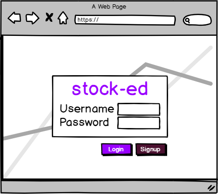
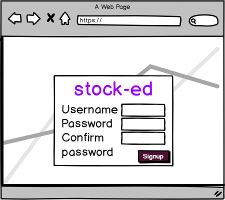
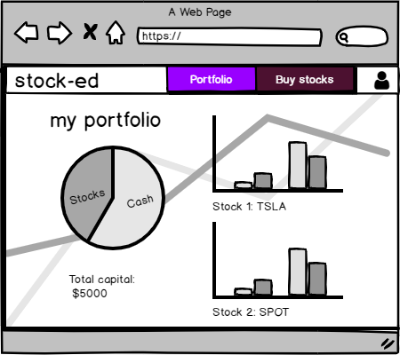
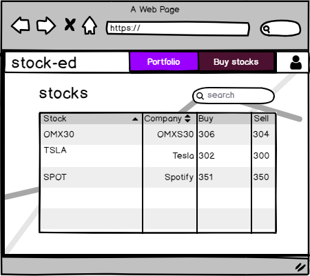
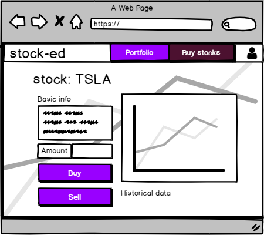
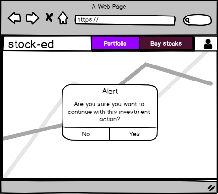
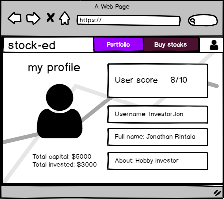

# stock-ed

## Run and build project locally

### Firebase backend config

Set the following environment variables on your system, in order to succesfully connect to the Firebase backend. The config variables can be found in your Firebase dashboard under 'Project settings':

```
const config = {
  apiKey: process.env.REACT_APP_API_KEY,
  authDomain: process.env.REACT_APP_AUTH_DOMAIN,
  databaseURL: process.env.REACT_APP_DATABASE_URL,
  projectId: process.env.REACT_APP_PROJECT_ID,
  storageBucket: process.env.REACT_APP_STORAGE_BUCKET,
  messagingSenderId: process.env.REACT_APP_MESSAGING_SENDER_ID
};
```

In the project directory, you can run:

### `npm start`

Runs the app in the development mode.<br />
Open [http://localhost:3000](http://localhost:3000) to view it in the browser.

The page will reload if you make edits.<br />
You will also see any lint errors in the console.

### `npm run build`

Builds the app for production to the `build` folder.<br />
It correctly bundles React in production mode and optimizes the build for the best performance.

The build is minified and the filenames include the hashes.<br />
Your app is ready to be deployed!

# Project proposal

## Description

This is a web app where you can set up your own virtual stock portfolio, see overall development on the portfolio as well as overtime development on specific stocks. The stocks can be bought with fake money and will then be added to a portfolio; thus, providing the user with the educational value of learning to trade and manage their assets, but without any associated risks. In addition, the user will possibly be given some sort of score according to ROI.

## Stack

The app will be built in React, with a backend in Firebase for data storage as well as authentication. Also, some Bootstrap will most likely be used for simplifying styling.

## API

Nordnet External API will be used to access all data concerning the stock information, such as stock buy/sell price and historical data. Nordnet has a reliable and widely used test API, which is simple to register for and utilize.

Reference: https://api.test.nordnet.se/

## Data

Our app will get all the data from the API connected to the individual portfolio, such as stocks in portfolio, purchase price, stock id, date of purchase and quantity. The users and their related information will be stored in the backend, and thus not retrieved via the Nordnet API.

## Mockup














